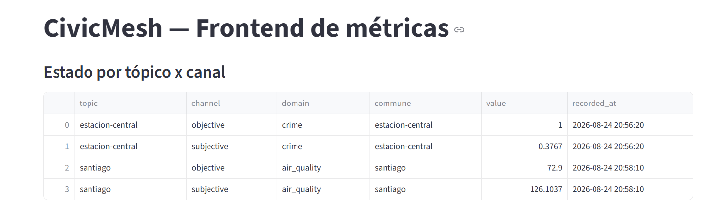
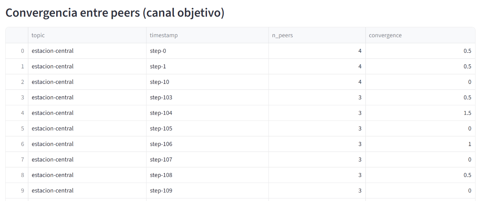
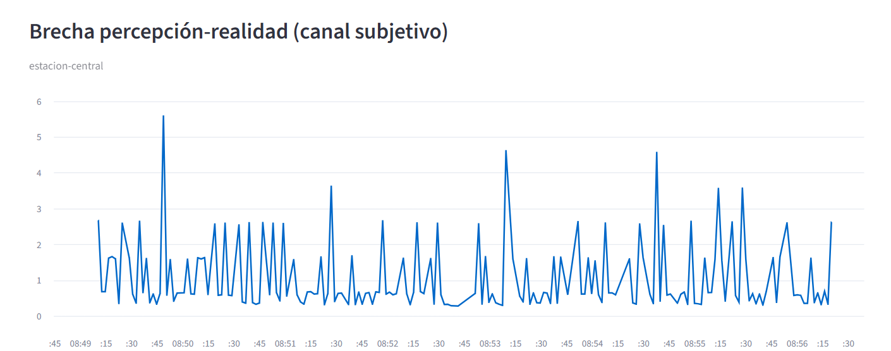
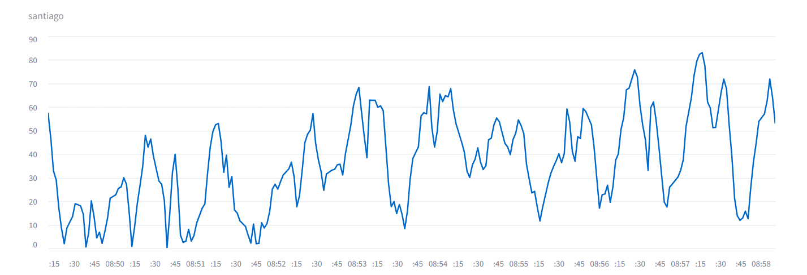

# Resultados — corrida Slurm local (sustituto de DIINF)

Evidencia real de `peers.sbatch` + `publishers.sbatch` corriendo contra un `slurm-wlm`
real en WSL2 (sin acceso a la VPN de DIINF; specs de la máquina y detalle completo de la
instalación en [`scripts/slurm/README.md`](../scripts/slurm/README.md)). Esta carpeta es
para que el equipo tenga los datos a mano sin tener que reproducir el cluster local —
para el informe (Sección 8: gráficos de convergencia/divergencia, mapa proceso↔nodo).

## `run-6/`

- **Jobs**: `peers.sbatch` → job 6 (partición `CPU`, nodos `cpu-node-01`/`02`, 4 peers:
  `peer-0-0` seed, `peer-0-1`, `peer-1-0`, `peer-1-1`). `publishers.sbatch` → job 7
  (partición `GPU`, `publisher-crime` en `estacion-central`, `publisher-air` en
  `santiago` con PM2.5 real de Open-Meteo).
- **`metrics/*.jsonl`**: un snapshot por mensaje entregado a cada peer (ambos canales,
  ambos dominios). `peer-1-0.jsonl` tiene menos líneas (366 vs. ~525-543 en el resto)
  porque ese peer fue matado a mitad de la corrida — ver más abajo.
- **`logs/`**: stdout de cada peer/publicador/frontend, más `frontend_host.txt` (dónde
  quedó escuchando el frontend) y `peers-submit.info`.
- **`domains.yaml` / `pubsub.yaml`**: snapshot de la config usada en esta corrida
  (`peers.sbatch` los copia automáticamente al armar el run, Sección 5.2 del enunciado).
- **`hostfile.txt`**: registro peer_id→host:puerto tal como lo arma el bootstrap
  (Sección 5.3).
- **`civicmesh-peers-6.out` / `civicmesh-publishers-7.out`**: stdout de los jobs de
  Slurm en sí (incluye el mapeo `step -> peer` que imprime `peers.sbatch`).

### Experimento de caída/partición incluido en esta corrida

`scancel 6.3` (a las 16:52:20) mató un peer real. El mapeo `step -> peer` que
`peers.sbatch` imprime al arrancar es **best-effort** (asume que Slurm asigna los steps
en el orden en que se lanzaron los `srun`) y en esta corrida particular **no acertó**:
decía que el step `6.3` era `peer-1-1`, pero el log (`peer-1-0.log`, últimas líneas) y
`squeue -j 6 -s` (el step 6.3 ya no aparece) confirman que el que realmente murió fue
`peer-1-0`. Es exactamente el caso que ya advertía el README de `scripts/slurm/` —
**conviene confirmar con `squeue -j <id> -s` antes de matar un step**, no confiar
ciegamente en el mapeo impreso.

Evidencia de la caída en `peer-1-0.log`:

```
2026-08-24 16:52:20  slurmstepd-cpu-node-02: STEP 6.3 ON cpu-node-02 CANCELLED
```

Y en los peers que siguieron vivos (`peer-0-0.log`, `peer-1-1.log`): ambos detectan a
`peer-1-0` como `DEAD` por timeout, de forma independiente, ~10s después:

```
2026-08-24 16:52:29  [peer-0-0] Peer peer-1-0 marcado como DEAD por timeout (10.08s sin contacto)
2026-08-24 16:52:29  [peer-1-1] Peer peer-1-0 marcado como DEAD por timeout (10.08s sin contacto)
```

## Capturas del frontend (`screenshots/`)

Las 3 vistas mínimas que pide la Sección 5.4, capturadas a mano del frontend real
corriendo contra esta misma corrida (job 7) — un intento automatizado con Chrome/Edge
headless no funcionó bien (la screenshot salía a mitad de cargar, antes de que
Streamlit terminara de pintar vía WebSocket):

- **Estado por tópico × canal** (`estado-topico-canal.png`): última muestra por
  tópico/canal/dominio.
- **Brecha percepción-realidad** (`brecha-percepcion-realidad-estacion-central.png`,
  `brecha-percepcion-realidad-santiago.png`): una por dominio -- delitos y aire.
- **Convergencia entre peers** (`convergencia-peers.png`): dispersión del canal
  objetivo entre los peers que siguen vivos por tópico/timestamp (`n_peers` baja de 4 a
  3 después del `scancel` descrito arriba).

| Estado por tópico × canal | Convergencia entre peers |
|---|---|
|  |  |

| Brecha percepción-realidad — delitos | Brecha percepción-realidad — aire |
|---|---|
|  |  |

El frontend en sí solo es accesible desde mi máquina (`http://localhost:8501`, WSL2
reenvía el puerto al host Windows) mientras yo deje la corrida levantada -- no hay forma
de que el resto del equipo lo vea en vivo sin conectarse a mi PC, por eso estas capturas
son la evidencia que queda en el repo.
